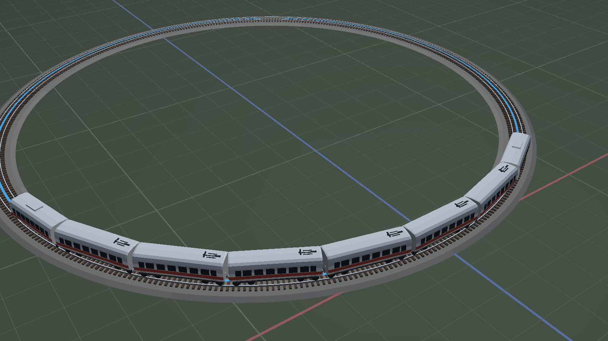

# 模拟铁轨 · TrainGame

一个用 Python + Panda3D 编写的 **3D 铁路沙盘游戏**：在一块场地上用「轨道件」拼出闭环线路，
放入多款中国铁路列车跑起来，再用车站、建筑、山体、树木、桥梁把场地布置成一个微缩世界。


## 特性

- **铺轨拼环**：直轨 / 曲线 / 坡道 / 高架桥 / 交叉 / 道岔共 7 类轨道件，可吸附拼接、`C` 一键闭合。
- **三种列车**：老式绿皮车、和谐号 CRH380A、复兴号 CR400AF —— 按真实车型标定质量 / 功率 / 黏着，起步、加速、上坡表现各不相同。
- **程序化布景**：山体、河流、湖泊、草地、站台、车站、村庄全部由种子驱动，同场景每次打开逐顶点一致。
- **手动布景模式**（`B`）：手工摆放民房 / 高楼 / 商场 / 便利店、老式（古典）与新式（现代）车站（自带站台）、大山 / 山丘、四种树木。
- **驾驶物理**：牵引 / 制动 / 惰行分档，支持换向、紧急制动；列车沿连通线运行，闭环绕圈、开链到头自停，扳道岔自动改线。
- **实时音效**：行驶声 + 轮轨声随车速实时变速变响（越快音调越高、轮轨声越密集），按 `J` 鸣笛；全部在运行时程序化合成，无需音频资源。
- **完整存档**：布局拓扑 + 布景一起存读，撤销 / 重做统一生效。
- **核显友好**：光照烘焙进顶点色、布景合批成单节点绘制，无实时阴影也能流畅。



## 快速开始

需要 Python ≥ 3.12。建议新建专用环境：

```powershell
conda create -n train3d python=3.12 -y
conda activate train3d
pip install panda3d==1.10.16 numpy
```

运行（Windows 下直接双击或命令行执行 `run.bat`，脚本会自行激活 `train3d` 环境）：

```powershell
run.bat                              # 空场地，从零铺轨
run.bat --list-scenes                # 列出所有现成场景
run.bat --scene valley               # 进入「山谷环线」，列车已上线
run.bat --scene overpass             # 进入「立体交叉」
run.bat --open saves\layout.json     # 读取存档继续编辑
run.bat --help                       # 全部命令行参数
```

等价写法：`python app/main.py ...`。

## 现成场景

| 场景 | 标题 | 一句话说明 | 自带列车 |
|---|---|---|---|
| `valley` | 山谷环线 | 群山夹着一条长环线，谷底有河、有村子、有草场 | 和谐号 CRH380A |
| `gorge` | 河谷大桥 | 高架桥两次跨过同一条河，桥墩落在河滩上 | 复兴号 CR400AF |
| `town` | 小镇车站 | 环线 + 尽头式岔线，月台、古典站房、村子和小山围着车站 | 老式绿皮车 |
| `lake` | 湖畔草原 | R80 大圆环绕着湖跑，沙滩、草地、小屋和远处草丘 | 老式绿皮车 |
| `overpass` | 立体交叉 | 高架跨过地面线：扳道岔到岔股，列车从桥底钻过 | 复兴号 CR400AF |

## 列车目录

| 列车 | 说明 |
|---|---|
| 老式绿皮车 | 机车 + 10 / 16 辆，动力集中，起步慢、上坡没劲 |
| 和谐号 CRH380A | 8 辆编组，动力分散，加速快 |
| 复兴号 CR400AF | 8 / 16 辆长编组，全目录加速最猛、极速最高 |

## 操作速查

| 键 | 作用 |
|---|---|
| 左键 | 放轨道 / 放布景（布景模式） |
| `V` | 放置轨道 ↔ 拖拽视角 |
| `,` `.` | 换分类（轨道件分类 / 布景分类） |
| `[` `]` | 换同类下一件 |
| `1`–`9` | 直选第 n 件 |
| `R` / `Shift+R` | 旋转待放件 |
| `C` | 一键闭合 |
| `U` | 扳道岔 |
| `X` / `Delete` | 删掉鼠标下这一节（轨道或布景） |
| `B` | 进入 / 退出布景模式（放建筑、车站、山、树） |
| `N` / `M` | 召唤 / 收起列车 |
| `↑` `↓` `空格` | 牵引 / 制动 / 惰行 |
| `K` | 换向（先急刹再反向加速） |
| `J` | 鸣笛 |
| `Shift+空格` | 紧急制动 |
| `G` `P` `L` `H` | 网格 / 端口 / 闭环彩带 / HUD 开关 |
| `退格` / `Z` | 撤销 |
| `Ctrl+S` / `Ctrl+O` | 另存为 / 读档（都弹输入框，可填文件名） |

完整说明见 [`docs/02-操作指南.md`](docs/02-操作指南.md)，设计背景见 [`docs/01-概要设计.md`](docs/01-概要设计.md)。

## 项目结构

```
app/          编辑器交互、HUD、主入口
core/         轨道几何、走线、动力学（纯逻辑，headless 可测）
render/       网格构建、布景、列车外观、场景
scenes/       现成场景预设与存档
data/         轨道件目录、列车数据（JSON）
scripts/      离屏出图等辅助脚本
tests/        739 条回归测试
docs/         设计与操作文档、配图
```

## 测试

```powershell
pytest
```

全库 **739 条测试** 通过，覆盖轨道几何、闭环检测、列车动力学、布景净空与序列化、编辑器交互、音效合成与 null 音频退化、HUD 版面等。

## 许可

采用 **BSD Zero Clause License（0BSD）** —— 最开放的 BSD 许可证：可任意使用、复制、修改、再分发（含商用与闭源），无需保留署名。详见 [`LICENSE`](LICENSE)。
