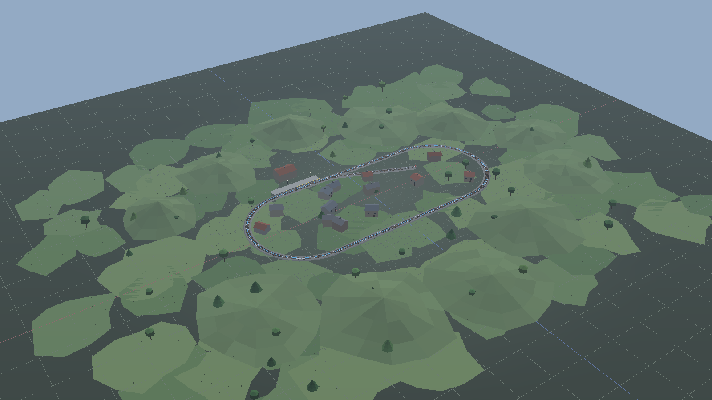
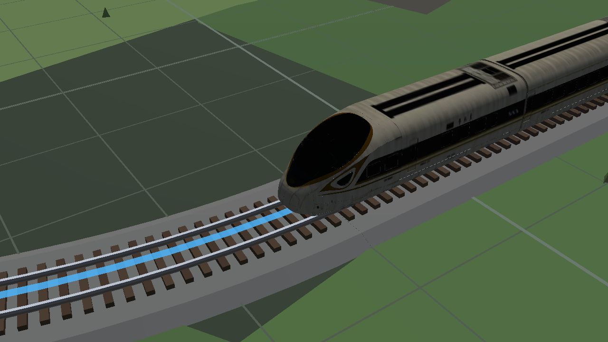

# 模拟铁轨 · TrainGame

一个用 Python + Panda3D 编写的 **3D 铁路沙盘游戏**：在一块场地上用「轨道件」拼出闭环线路，
放入多款中国铁路列车跑起来，再用车站、建筑、山体、树木、桥梁把场地布置成一个微缩世界。



## 特性

- **铺轨拼环**：直轨 / 曲线 / 坡道 / 高架桥 / 交叉 / 道岔 / 终端共 7 类轨道件，可吸附拼接、`C` 一键闭合。
- **多种列车**：老式绿皮车、和谐号、复兴号（程序化车体）+ **复兴号黄丝带 400BF**（`models/` 里的 `.glb` 外观，8 / 16 辆；16 辆为两列 8 节重联、中间两头车对顶）。质量和功率按车型标定，起步 / 加速 / 上坡手感不同。
- **程序化布景**：山体、河流、湖泊、草地、站台、车站、村庄全部由种子驱动，同场景每次打开逐顶点一致。
- **手动布景模式**（`B`）：手工摆放民房 / 高楼 / 商场 / 便利店、老式与新式车站（自带站台）、七种山体、八种树木、五档湖泊、五档绿地。
- **驾驶物理**：牵引 / 制动 / 惰行分档，支持换向、紧急制动；列车沿连通线运行，闭环绕圈、开链到头自停，扳道岔自动改线。首尾已经吸附到**严丝合缝**的链即使没按 `C` 也照样算环 —— 判据是几何（缝宽 < 1e-6 m），不是"连接表里有没有那条边"，所以列车不会停在一道看不见的缝上。
- **实时音效**：**引擎声**随车速实时变速变响（越快音调越高、音量越大，怠速时很轻），叠加一层**连续的轮轨滚动声**（起步后出现，随车速变响变亮），按 `J` 是低音风笛；全部在运行时程序化合成，无需音频资源。音轨里**没有打点 / 电子提示音** —— 轮轨声刻意做成无瞬态的连续底噪，所以提速也不会变成"嗒嗒嗒"（见 `render/audio.py` 里"哐当和嘀嘀是两回事"）。
- **完整存档**：布局拓扑 + 布景一起存读，撤销 / 重做统一生效。
- **核显友好**：光照烘焙进顶点色、布景合批成单节点绘制；建筑门前灯默认全开（左侧「路灯」总开关可整片熄灭）。
- **HUD**：左侧可伸缩信息栏（状态 / 闭环 / 帮助）；列车**运行信息常驻右下角**。
- **可打成单个 exe**：`python scripts/build_exe.py` 一条命令产出免装 Python 的 `TrainGame.exe`（见下文）。



## 快速开始

需要 Python ≥ 3.12。建议新建专用环境：

```powershell
conda create -n train3d python=3.12 -y
conda activate train3d
pip install panda3d==1.10.16 numpy
```

运行（Windows 下直接双击或命令行执行 `run.bat`，脚本会自行激活 `train3d` 环境）：

```powershell
run.bat                              # 空场地，从零铺轨
run.bat --list-scenes                # 列出所有现成场景
run.bat --scene valley               # 进入「山谷环线」，列车已上线
run.bat --scene overpass             # 进入「立体交叉」
run.bat --open saves\layout.json     # 读取存档继续编辑
run.bat --help                       # 全部命令行参数
```

等价写法：`python app/main.py ...`。

## 打包成 exe（免装 Python）

**不想装环境？** 直接下 [最新 Release](https://github.com/morenfang/TrainGame/releases/latest) 里的 `TrainGame.exe`
（42 MB，双击即玩；同一个 Release 里还挂了操作手册 PDF 和 10 个现成场景存档）。想要自己打，
一条命令产出**单文件** Windows 程序（自带 Python、Panda3D 与件库数据）：

```powershell
pip install pyinstaller          # 只有"打包"这一步需要它（玩游戏不需要）
python scripts/build_exe.py      # → dist\TrainGame.exe
```

脚本会依次：检查 panda3d 那堆 DLL 的依赖闭包（哪些删不得是**量**出来的，不是猜的）
→ 画图标 → 跑 PyInstaller → **复核整包依赖**（读清单逐个二进制核，专抓"少一个 DLL
也能打出来、只在运行时炸"那一类）→ 铺示例存档与手册 → 拿真 exe 跑一遍离屏渲染冒烟测试。

```powershell
dist\TrainGame.exe                        双击即玩（空场地）
dist\TrainGame.exe --scene valley         直接进入「山谷环线」，列车已上线
dist\TrainGame.exe --open saves\valley.json
dist\TrainGame.exe --list-scenes          另开一个命令行窗口列出所有场景
```

`dist\` 里除 exe 外还会铺好 `saves\*.json`（示例存档）、`README.md` 与操作手册 PDF。
**发出去时带上整个 `dist\` 最好，只发 exe 也能跑** —— 存档目录与日志会在需要时自动
建在 exe 旁边。

三个和 exe 有关的路径约定（实现见 [`core/paths.py`](core/paths.py)）：

| 东西 | 位置 |
|---|---|
| `data/*.json`（只读件库） | 打进 exe 内部，运行时从临时解包目录读 |
| 存档（可写） | **exe 旁边的 `saves\`**；该目录不可写（如装在 `Program Files`）时退到 `%LOCALAPPDATA%\TrainGame\saves` |
| 日志 | exe 旁边的 `train3d_log.txt`（启动失败时弹的窗里会写它在哪） |

> 存档是"跟着 exe 走"而不是"跟着仓库走"，这不是随手定的：onefile 的 exe 每次启动
> 都解包到一个**临时目录**、退出时整个删掉。把存档写进那里，表现是「Ctrl+S 提示已
> 保存 → 关掉游戏文件就没了 → 全程没有任何报错」。所以可写的东西一律落在 exe 旁边，
> 拷进 U 盘时存档跟着一起走。
>
> `--list-scenes` / `--help` 的结果是纯文本，而窗口版程序没有控制台 —— 它们会
> **另开一个属于自己的命令行窗口**把内容打出来，看完按回车关闭。

想要启动更快、更好排查的目录版：`python scripts/build_exe.py --onedir`。

## 现成场景

| 场景 | 标题 | 一句话说明 | 自带列车 |
|---|---|---|---|
| `valley` | 山谷环线 | 群山夹着一条长环线，谷底有河、有村子、有草场 | 复兴号黄丝带 400BF · 8 辆 |
| `gorge` | 河谷大桥 | 高架桥两次跨过同一条河，桥墩落在河滩上 | 复兴号黄丝带 400BF · 8 辆 |
| `town` | 小镇车站 | 环线 + 尽头式岔线，月台、古典站房、村子和小山围着车站 | 复兴号黄丝带 400BF · 8 辆 |
| `lake` | 湖畔草原 | R80 大圆环绕着湖跑，沙滩、草地、小屋和远处草丘 | 复兴号黄丝带 400BF · 8 辆 |
| `overpass` | 立体交叉 | 高架跨过地面线：扳道岔到岔股，列车从桥底钻过 | 复兴号黄丝带 400BF · 16 辆 |

## 列车目录

| 列车 | 说明 |
|---|---|
| **复兴号黄丝带 400BF · 8 辆** | `.glb` 外观 |
| **复兴号黄丝带 400BF · 16 辆** | 两列 8 节重联，中间两头车鼻锥对顶 |

按 `N` 只在这两档间切换。新车：glb 放进 [`models/`](models/)，在 [`data/trains.json`](data/trains.json) 加编组并写 `"mesh"`；见 [`render/gltf_train.py`](render/gltf_train.py)。

## 操作速查

| 键 | 作用 |
|---|---|
| 左键 | 放轨道 / 放布景（布景模式） |
| `V` | 放置轨道 ↔ 拖拽视角 |
| `,` `.` | 换分类（轨道件分类 / 布景分类） |
| `[` `]` | 换同类下一件 |
| `1`–`9` | 直选第 n 件 |
| `R` / `Shift+R` | 旋转待放件 |
| `T` | 切换接驳端口（从 a 端还是 b 端接上去） |
| `F` | 取景：自动框住整个场地 |
| `C` | 一键闭合 |
| `U` | 扳道岔 |
| `X` / `Delete` | 删掉鼠标下这一节轨道，或布景模式下的建筑 / 车站 / 山 / 树 / 湖 / 绿地 |
| `B` | 进入 / 退出布景模式（放建筑、车站、山、树、湖、绿地） |
| `N` / `M` | 召唤 / 收起列车 |
| `↑` `↓` `空格` | 牵引 / 制动 / 惰行 |
| `K` | 换向（先急刹再反向加速） |
| `J` | 鸣笛（低音风笛） |
| `Shift+空格` | 紧急制动 |
| `G` `P` `L` `H` | 网格 / 端口 / 闭环彩带 / 左侧信息栏（运行信息常驻右下角） |
| `退格` / `Z` / `Ctrl+Z` | 撤销 |
| `Shift+Z` / `Y` / `Ctrl+Y` | 重做 |
| `Ctrl+S` / `Ctrl+O` | 另存为 / 读档（都弹输入框，可填文件名） |

鼠标：左键（视角模式）拖拽 / 右键拖拽 = 环绕，中键拖拽 = 平移，滚轮 = 缩放。
拖拽方向一律「抓住画面拖」——鼠标往右拖，场地就跟着往右走（和 Google Earth 一致）。

完整说明见 [`docs/02-操作指南.md`](docs/02-操作指南.md)，设计背景见 [`docs/01-概要设计.md`](docs/01-概要设计.md)。

## 项目结构

```
app/          编辑器交互、HUD、主入口（含打包后的无控制台入口 winmain.py）
core/         轨道几何、走线、动力学（纯逻辑，headless 可测）
render/       网格构建、布景、列车外观（含 glTF 编组）、场景
scenes/       现成场景预设与存档
data/         轨道件目录、列车数据（JSON）
models/       可选编组 .glb（有则优先于程序化车体；打进 exe）
scripts/      离屏出图、Blender 洗模、操作手册排版、打包 exe 等
packaging/    PyInstaller spec、图标生成、DLL 依赖闭包检查（打包用，游戏不需要）
tests/        回归测试
docs/         设计与操作文档、配图、操作手册 PDF
```

## 文档

| 文档 | 内容 |
|---|---|
| [`docs/02-操作指南.md`](docs/02-操作指南.md) | 按键与流程速查（**手册正本**） |
| [`docs/模拟铁轨-操作手册.pdf`](docs/模拟铁轨-操作手册.pdf) | 上面那份的排版产物，改完正本跑 `python scripts/manual_pdf.py` 重新生成 |
| [`docs/01-概要设计.md`](docs/01-概要设计.md) | 设计背景与验收标准 |

## 测试

```powershell
pytest
```

全库 **869 条测试** 通过，覆盖轨道几何、闭环检测、列车动力学、布景净空与序列化（含湖 / 绿地 / 多种山与树）、编辑器交互、相机拖拽方向、音效合成（含"不是蜂鸣器"的听感断言）与 null 音频退化、HUD 版面（左侧栏 + 右下运行信息）、操作手册排版与按键文档同步，以及**打包侧的运行时路径**（源码态 / 冻结态两条分支、存档绝不落进临时解包目录）与**无控制台入口的分流**（开游戏不开控制台、纯文本参数走控制台或弹窗、启动异常必须报出来）。

## 许可

采用 **BSD Zero Clause License（0BSD）** —— 最开放的 BSD 许可证：可任意使用、复制、修改、再分发（含商用与闭源），无需保留署名。详见 [`LICENSE`](LICENSE)。
